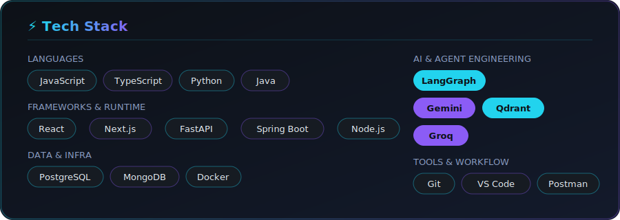
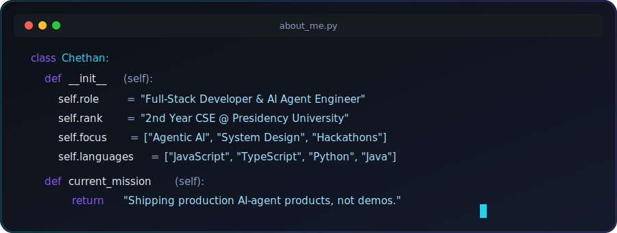
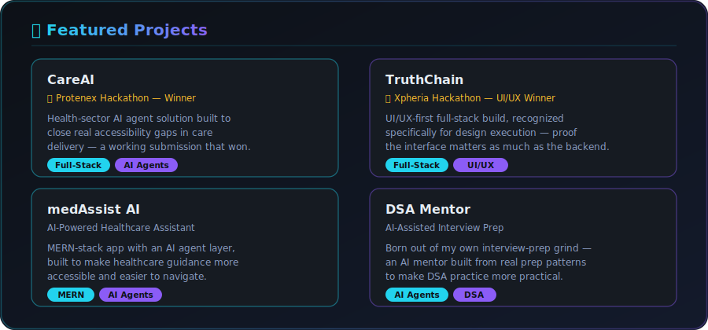
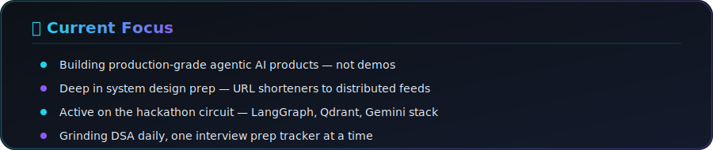

<!-- ═══════════════════════════════════════════════════════════════════ -->
<!-- HERO SECTION -->
<!-- ═══════════════════════════════════════════════════════════════════ -->

&nbsp;

<!-- ═══════════════════════════════════════════════════════════════ -->
<!-- TECH STACK -->
<!-- ═══════════════════════════════════════════════════════════════ -->

<!-- ═══════════════════════════════════════════════════════════════ -->
<!-- ABOUT ME -->
<!-- ═══════════════════════════════════════════════════════════════ -->

<!-- ═══════════════════════════════════════════════════════════════════ -->
<!-- FEATURED PROJECTS -->
<!-- ═══════════════════════════════════════════════════════════════════ -->

<!-- ═══════════════════════════════════════════════════════════════ -->
<!-- GITHUB STATS -->
<!-- ═══════════════════════════════════════════════════════════════ -->

<!-- ═══════════════════════════════════════════════════════════════ -->
<!-- CURRENT FOCUS -->
<!-- ═══════════════════════════════════════════════════════════════ -->

<!-- ═══════════════════════════════════════════════════════════════ -->
<!-- SOCIAL LINKS -->
<!-- ═══════════════════════════════════════════════════════════════ -->

  
  
  

<i>Open for internships and collaboration · MERN · AI Agents</i>

<!-- ═══════════════════════════════════════════════════════════════════ -->
<!-- FOOTER -->
<!-- ═══════════════════════════════════════════════════════════════════ -->

