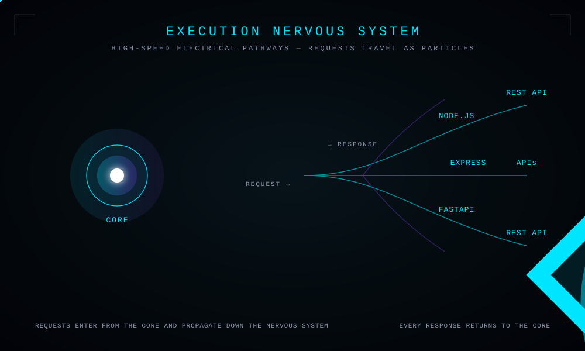
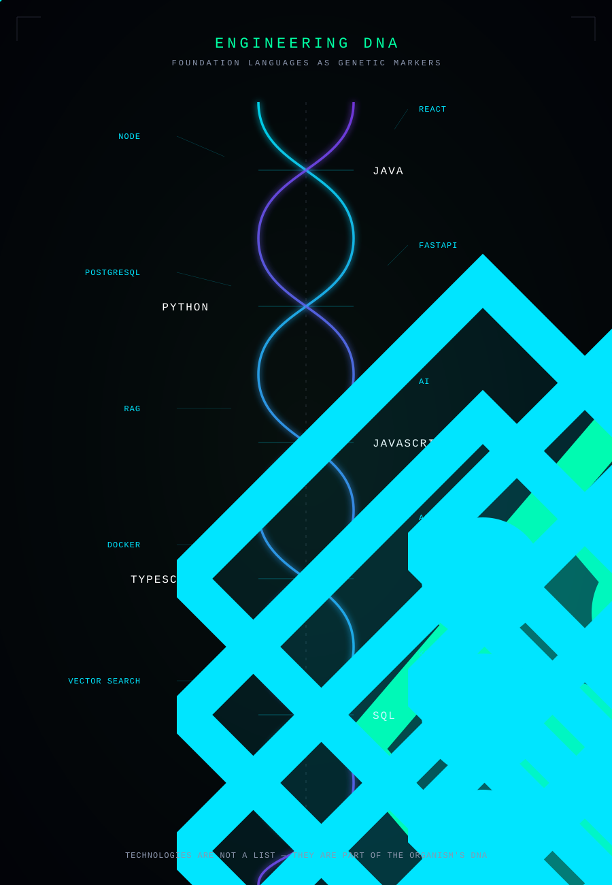
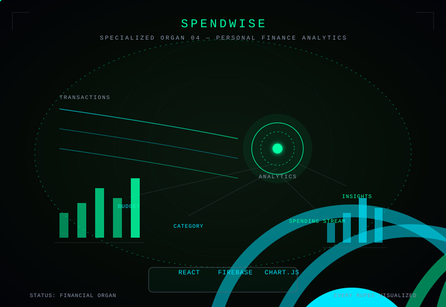
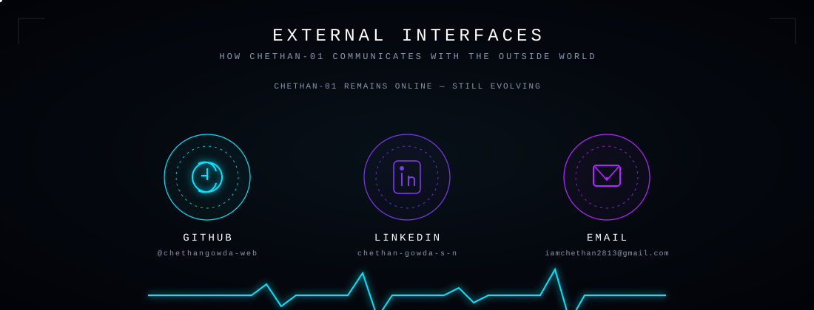

<!-- ══════════════════════════════════════════════════════════ -->
<!-- ═════════════════ MASTER SPECIMEN ═══════════════════════ -->
<!-- ══════════════════════════════════════════════════════════ -->



CLASSIFIED · SCIENTIFIC BLUEPRINT · ROTATION 00 · OPENED FOR PUBLIC INSPECTION

 

PORTABLE SCAN — COMPACT VIEW

 



 

<!-- ══════════════════════════════════════════════════════════ -->
<!-- ═════════════════ SYSTEM ANATOMY ═════════════════════════ -->
<!-- ══════════════════════════════════════════════════════════ -->

—— SYSTEM ANATOMY — SELECT A SYSTEM ——

  

<a href="#cortex">01 CORTEX</a>&nbsp;·&nbsp;
<a href="#core">02 CORE</a>&nbsp;·&nbsp;
<a href="#execution">03 EXECUTION</a>&nbsp;·&nbsp;
<a href="#memory">04 MEMORY</a>&nbsp;·&nbsp;
<a href="#frame">05 FRAME</a>&nbsp;·&nbsp;
<a href="#dna">06 DNA</a>&nbsp;·&nbsp;
<a href="#organs">07 ORGANS</a>&nbsp;·&nbsp;
<a href="#cells">08 CELLS</a>&nbsp;·&nbsp;
<a href="#evolution">09 EVOLUTION</a>&nbsp;·&nbsp;
<a href="#interfaces">10 INTERFACES</a>

  

SUBJECT — <b>CHETHAN-01</b> — A FULL-STACK AI ENGINEERING SYSTEM
CARRIER — CHEthan Gowda · 3rd YEAR CSE · FULL-STACK + AI + BACKEND + SYSTEMS

 

 

<!-- ══════════════════════════════════════════════════════════ -->
<!-- ═════════════════ 01 — NEURAL CORTEX ═════════════════════ -->
<!-- ══════════════════════════════════════════════════════════ -->

<h2 align="center">01 · NEURAL CORTEX</h2>

GENERATIVE INTELLIGENCE LAYER

 



 

<!-- ══════════════════════════════════════════════════════════ -->
<!-- ═════════════════ 02 — ENGINEERING CORE ══════════════════ -->
<!-- ══════════════════════════════════════════════════════════ -->

<h2 align="center">02 · ENGINEERING CORE</h2>

THE SUBJECT — PRIMARY ENERGY SOURCE

 



 

<!-- ══════════════════════════════════════════════════════════ -->
<!-- ═══════════════ 03 — EXECUTION NERVOUS SYSTEM ════════════ -->
<!-- ══════════════════════════════════════════════════════════ -->

<h2 align="center">03 · EXECUTION NERVOUS SYSTEM</h2>

REQUESTS PROPAGATE AS PARTICLES — RESPONSES RETURN TO THE CORE

 



 

<!-- ══════════════════════════════════════════════════════════ -->
<!-- ═════════════════ 04 — MEMORY CORE ═══════════════════════ -->
<!-- ══════════════════════════════════════════════════════════ -->

<h2 align="center">04 · MEMORY CORE</h2>

CRYSTALLINE STORAGE + VECTOR CHAMBER

 

<table width="100%">
<tr>
<td width="56%" valign="middle"></td>
<td width="44%" valign="middle"></td>
</tr>
</table>

 

<!-- ══════════════════════════════════════════════════════════ -->
<!-- ═════════════════ 05 — INFRASTRUCTURE FRAME ══════════════ -->
<!-- ══════════════════════════════════════════════════════════ -->

<h2 align="center">05 · INFRASTRUCTURE FRAME</h2>

THE SKELETON — SUPPORTS EVERYTHING · VISIBLE IN THE BASE OF THE MASTER SCAN

 

`DOCKER` · `KUBERNETES` · `CELERY` · `GIT` · `GITHUB` · `VERCEL`

  

 

<!-- ══════════════════════════════════════════════════════════ -->
<!-- ═════════════════ 06 — ENGINEERING DNA ═══════════════════ -->
<!-- ══════════════════════════════════════════════════════════ -->

<h2 align="center">06 · ENGINEERING DNA</h2>

FOUNDATION LANGUAGES AS GENETIC MARKERS

 



 

<!-- ══════════════════════════════════════════════════════════ -->
<!-- ═══════════════ 07 — SPECIALIZED ORGANS ══════════════════ -->
<!-- ══════════════════════════════════════════════════════════ -->

<h2 align="center">07 · SPECIALIZED ORGANS</h2>

PROJECTS ARE NOT CARDS — THEY ARE ORGANS DEVELOPED BY THE ORGANISM

  



  



  



  



  

 

<!-- ══════════════════════════════════════════════════════════ -->
<!-- ═══════════════ 08 — CELLULAR ACTIVITY ═══════════════════ -->
<!-- ══════════════════════════════════════════════════════════ -->

<h2 align="center">08 · CELLULAR ACTIVITY</h2>

ARTISTIC METAPHOR — EVERY CONTRIBUTION IS A CELL ACTIVATION

 



 

FACTUAL DATA — THE ORGANISM'S REAL LIFESIGN

  

 

COMMIT → BUILD → DEBUG → SHIP → COMMIT

 

 

<!-- ══════════════════════════════════════════════════════════ -->
<!-- ═══════════════ 09 — EVOLUTION PROTOCOL ══════════════════ -->
<!-- ══════════════════════════════════════════════════════════ -->

<h2 align="center">09 · EVOLUTION</h2>

MUTATIONS · PROTOCOL · TARGET

 



 

<!-- ══════════════════════════════════════════════════════════ -->
<!-- ═══════════════ 10 — EXTERNAL INTERFACES ═════════════════ -->
<!-- ══════════════════════════════════════════════════════════ -->

<h2 align="center">10 · EXTERNAL INTERFACES</h2>

HOW CHETHAN-01 COMMUNICATES WITH THE OUTSIDE WORLD

 



  

<a href="https://github.com/chethangowda-web">GITHUB · chethangowda-web</a>&nbsp;·&nbsp;
<a href="https://www.linkedin.com/in/chethan-gowda-s-n-abb165329/">LINKEDIN · chethan-gowda-s-n</a>&nbsp;·&nbsp;
<a href="mailto:iamchethan2813@gmail.com">EMAIL · iamchethan2813@gmail.com</a>

  

CHETHAN-01 REMAINS ONLINE — STILL EVOLVING

 

 

<a href="#top">
⤒ RETURN TO MASTER SCAN
</a>