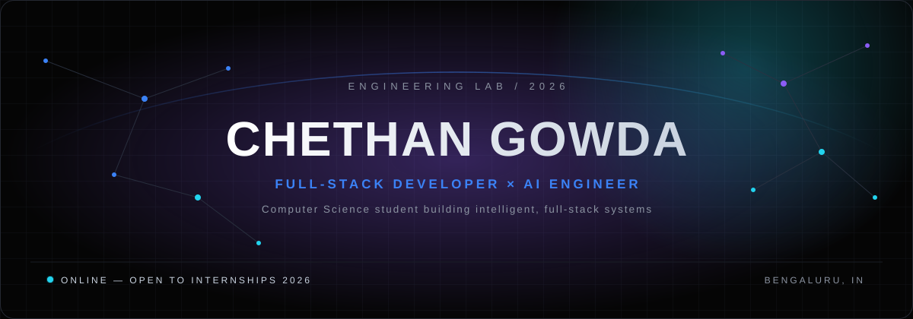
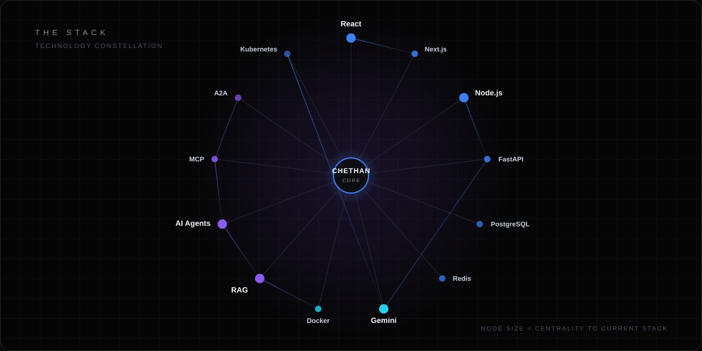
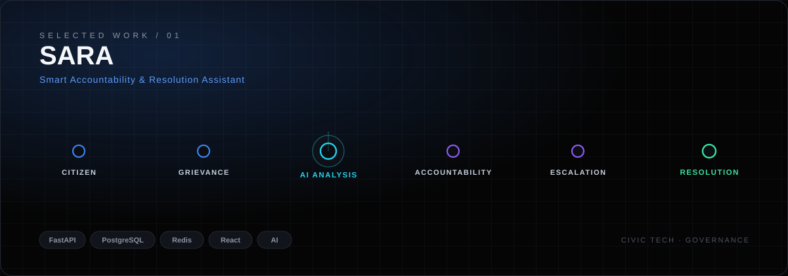
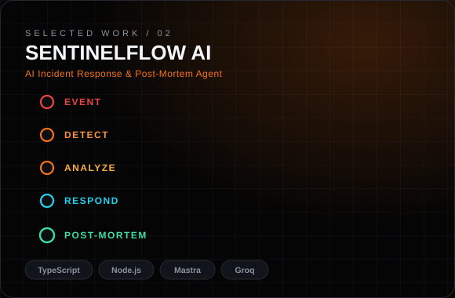
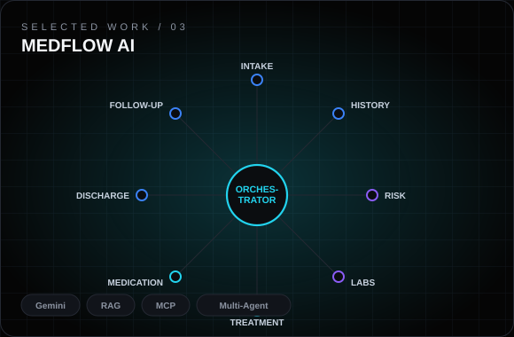
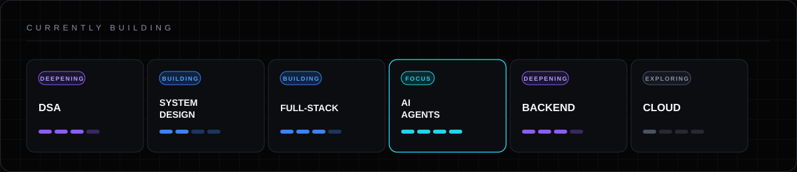
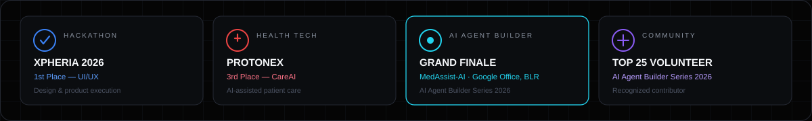
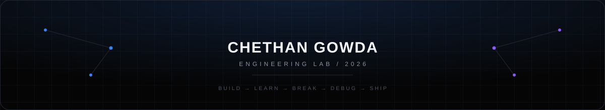

 

<table width="100%">
<tr>
<td width="62%" valign="top">

</td>
<td width="38%" valign="top">

WHO I AM

<h2>ENGINEER / BUILDER</h2>

Computer Science student building full-stack applications, AI agents, and intelligent systems.

Presidency University, Bengaluru · Batch 2023–2027

  

OPEN TO — FRONTEND / SDE INTERNSHIPS, Q4 2026

</td>
</tr>
</table>

 

<table width="100%">
<tr>
<td width="33%"></td>
<td width="33%"></td>
<td width="34%"></td>
</tr>
<tr>
<td width="33%"></td>
<td width="33%"></td>
<td width="34%"></td>
</tr>
</table>

 

  

SELECTED WORK

 

<table width="100%">
<tr>
<td width="50%"></td>
<td width="50%"></td>
</tr>
</table>

 

  

  

<table width="100%">
<tr>
<td width="60%" valign="top">

GITHUB ACTIVITY

  

</td>
<td width="40%" valign="top">

LANGUAGE DNA

  

</td>
</tr>
</table>

 

## LET'S BUILD

 

