

<!-- ================= HERO — CITY NIGHT VIEW ================= -->

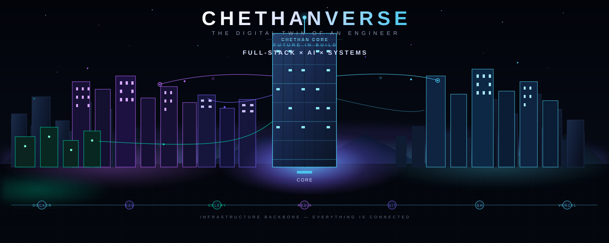

DAY / NIGHT TRANSITION

 

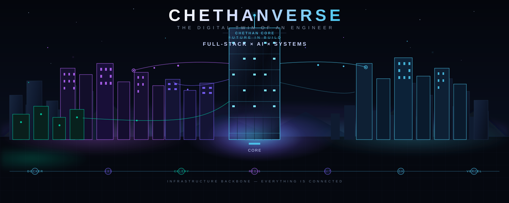

 

<!-- ================= CITY NAVIGATION ================= -->

—— CITY NAVIGATION SYSTEM ——

  

<a href="#core" style="text-decoration:none">CORE</a> ·&nbsp;
<a href="#ai" style="text-decoration:none">AI</a> ·&nbsp;
<a href="#web" style="text-decoration:none">WEB</a> ·&nbsp;
<a href="#backend" style="text-decoration:none">BACKEND</a> ·&nbsp;
<a href="#data" style="text-decoration:none">DATA</a> ·&nbsp;
<a href="#projects" style="text-decoration:none">PROJECTS</a> ·&nbsp;
<a href="#archive" style="text-decoration:none">ARCHIVE</a> ·&nbsp;
<a href="#horizon" style="text-decoration:none">HORIZON</a> ·&nbsp;
<a href="#exit" style="text-decoration:none">EXIT</a>

  

<!-- ================= CITY MAP ================= -->

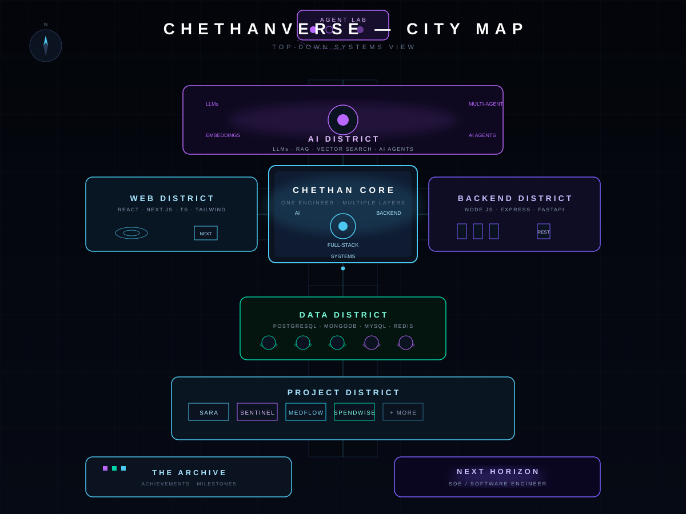

POCKET MAP — MOBILE VIEW

 

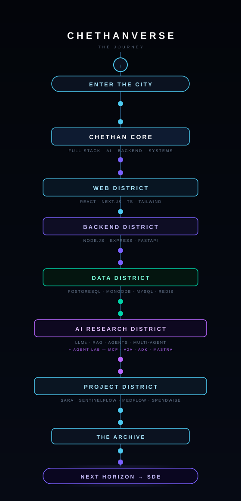

 

<!-- ================= THE CORE ================= -->

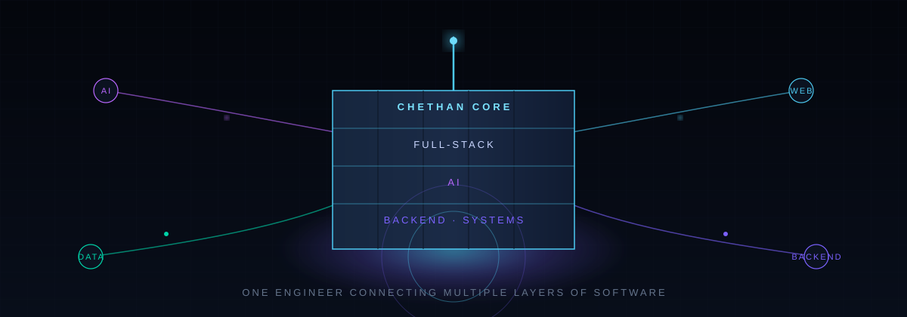

 

THE CORE

**I AM CHETHAN GOWDA** — a Computer Science Engineering student at Presidency University, Bengaluru (Batch 2023–2027), building full-stack applications, AI agents, and intelligent systems.

At the center of this city lives one engineer who connects every layer of software — interfaces, APIs, data, models, and infrastructure.

OPEN TO — FRONTEND / SDE INTERNSHIPS, Q4 2026

 

 

<!-- ================= EXPLORE THE SYSTEMS ================= -->

— EXPLORE THE SYSTEMS —

 

<table width="100%">
<tr>
<td width="50%" valign="top">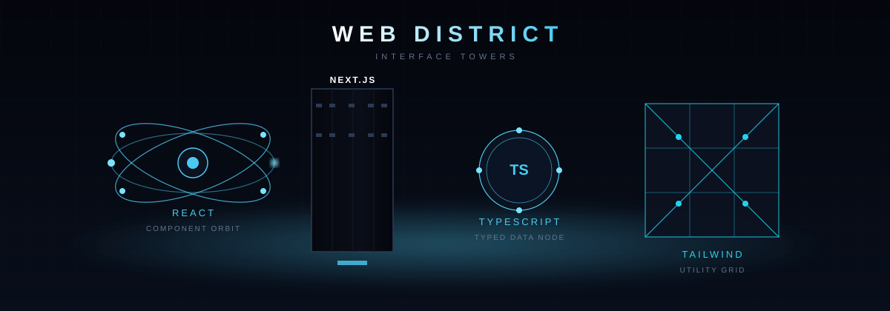</td>
<td width="50%" valign="top">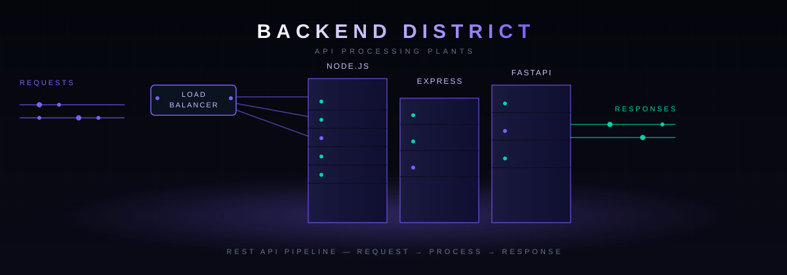</td>
</tr>
</table>

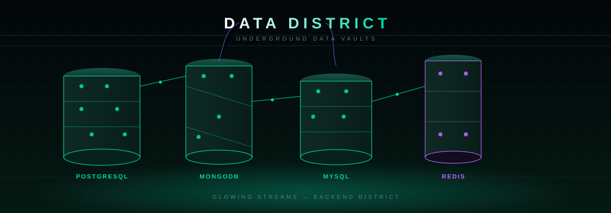

 

<!-- ================= AI DISTRICT ================= -->

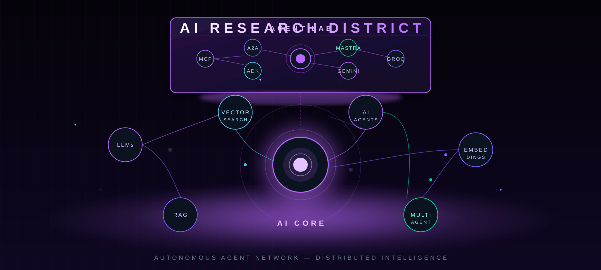

AI RESEARCH + AGENT LAB — LLMs · RAG · Vector Search · AI Agents · Multi-Agent Systems · MCP · A2A · ADK · Mastra

  

<!-- ================= PROJECT DISTRICT ================= -->

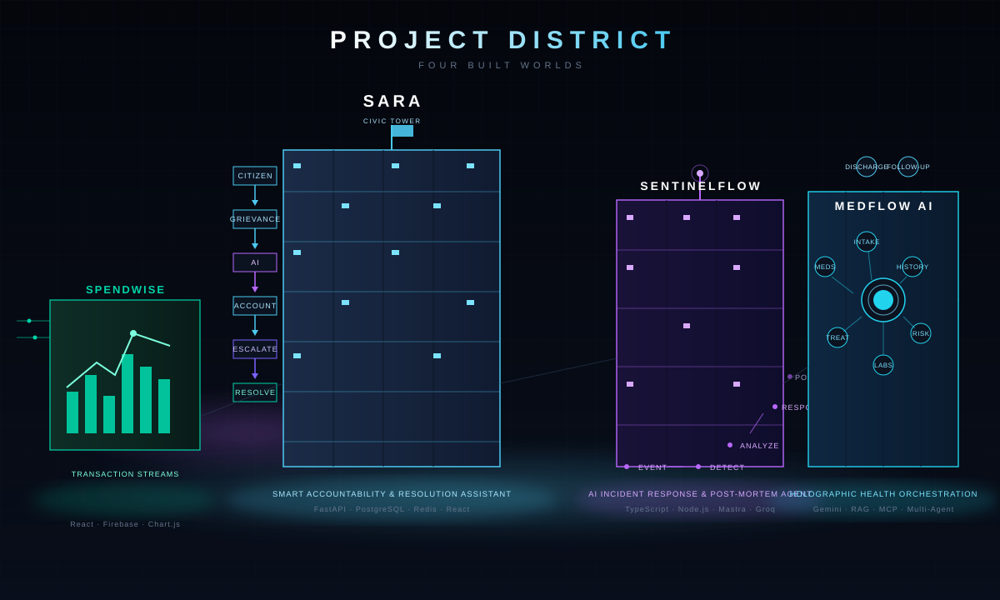

SELECTED PROJECTS — BUILT INSIDE THE CITY

 

EXPLORE EACH BUILDING

 

<table width="100%">
<tr>
<td width="50%" valign="top">

**🏛️ SARA** — *Smart Accountability & Resolution Assistant*

Civic-tech AI that turns citizen grievances into tracked, escalating, and resolved outcomes — an accountability engine for public service.

`FastAPI · PostgreSQL · Redis · React`

</td>
<td width="50%" valign="top">

**🛡️ SentinelFlow AI** — *AI Incident Response & Post-Mortem Agent*

Event stream monitoring with AI-driven detection, analysis, response, and post-mortem automation for modern infrastructure.

`TypeScript · Node.js · Mastra · Groq`

</td>
</tr>
<tr>
<td width="50%" valign="top">

**🩺 MedFlow AI** — *Holographic Health Orchestration*

A multi-agent care pipeline — intake, history, risk, labs, treatment, medication, discharge, follow-up — orchestrated around one core.

`Gemini · RAG · MCP · Multi-Agent`

</td>
<td width="50%" valign="top">

**📈 SpendWise** — *Personal Finance Terminal*

Financial graphs, transaction streams, and budget nodes that visualize every rupee moving through the system.

`React · Firebase · Chart.js`

</td>
</tr>
</table>

  

<!-- ================= THE ARCHIVE ================= -->

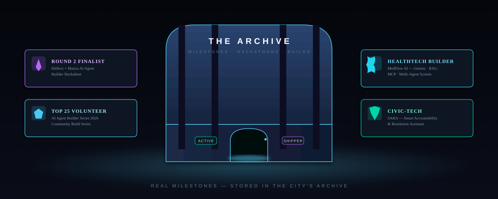

 

THE ARCHIVE — REAL MILESTONES

UNLOCK THE RECORDS

 

- **Round 2 Finalist** — HiDevs × Mastra AI Agent Builder Hackathon
- **Top 25 Volunteer** — AI Agent Builder Series 2026
- **HealthTech Builder** — MedFlow AI (Gemini · RAG · MCP · Multi-Agent)
- **Civic-Tech** — SARA, Smart Accountability & Resolution Assistant
- **Active Ship** — hackathons & continuous project building

  

<!-- ================= CITY ENERGY ================= -->

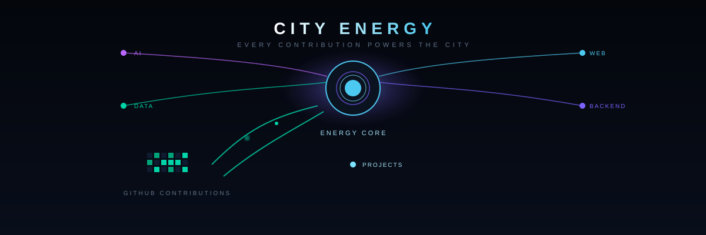

 

THE POWER GRID

 

REAL CONTRIBUTION DATA — FEEDING THE CITY

  

<table width="100%">
<tr>
<td width="60%" valign="top">

GITHUB ACTIVITY

  

</td>
<td width="40%" valign="top">

LANGUAGE DNA

  

</td>
</tr>
</table>

 

<!-- ================= ENGINEERING STACK ================= -->

ENGINEERING STACK — CITY LEGEND

 

<table width="100%">
<tr>
<td width="33%" valign="top">

**Languages**

Java · Python · JavaScript · TypeScript · SQL

**Frontend**

React · Next.js · Tailwind CSS · HTML · CSS

</td>
<td width="34%" valign="top">

**Backend**

Node.js · Express · FastAPI · REST APIs

**Data**

PostgreSQL · MongoDB · MySQL · Redis

**AI / ML**

Generative AI · LLMs · RAG · AI Agents · Multi-Agent Systems · scikit-learn · Hugging Face · Sentence Transformers · Ollama · Qdrant

</td>
<td width="33%" valign="top">

**AI Engineering**

Gemini · Groq · Google AI Studio · Google ADK · MCP · A2A · Mastra

**Infrastructure**

Docker · Kubernetes · Celery · Git · GitHub · Vercel

**Tools**

Firebase · Playwright · Google Maps API · Figma

</td>
</tr>
</table>

 

<!-- ================= NEXT HORIZON ================= -->

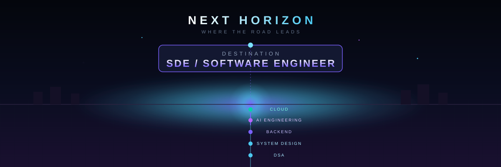

 

 

<!-- ================= LET'S BUILD / EXIT ================= -->

## LET'S BUILD

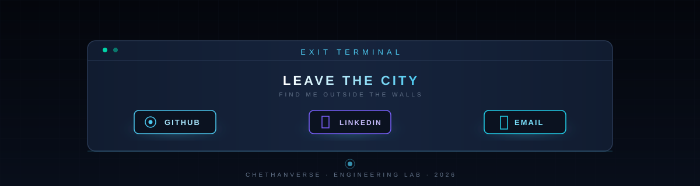

 

 

YOU ARE LEAVING CHETHANVERSE — THE CITY STAYS ON

 

<a href="#top" style="text-decoration:none">
⤒ RETURN TO THE SKYLINE
</a>